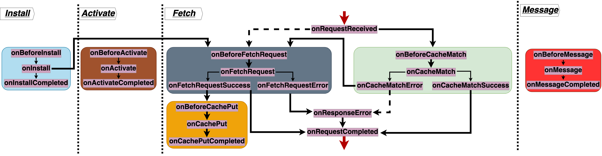

# swebRequest: the secure service workers library


`swebRequest` is a library for writing service workers (SWs) and augmenting them with security and privacy features. Visit [our demo](https://swebrequest.doitsec.net/home.htm) website to see its features in action.

## Baseline service workers (SWs) deployment
Following is a whole service worker (SW) implementing a default [cacheFirst](https://developer.chrome.com/docs/workbox/modules/workbox-strategies/#cache-first-cache-falling-back-to-network) routing strategy for intercepted HTTP requests. More [routing strategies](strategies.md) can be enabled for specific types of requests.
```javascript
importScripts("swebRequest.js");
swebRequest.init();
```

## Standalone: augmenting SWs with security and privacy features
Now this baseline SW can be easily augmented with security and privacy features. Here is an example usages of many features, including [cspnonces](features/cspnonces.md) that generate fresh and secure nonces to replace cached, old and insecure nonces. The [anonymize_xor](features/anonymize_xor.md) feature anonymizes third party requests to by rewritting and and reomving cookies. Crypto on the cache is one of the most important features `swebRequest` provides out of the box. The [encryption](features/encryption.md) and [decryption](features/decryption.md) features respectively encrypts HTTP requests before they are stored in the cache and decrypts HTTP responses after they are read from the cache. These features mitigates threats where web attackers tampers with cached content. 
```javascript
importScripts("swebRequest.js");
swebRequest.init({
	anonymize_xor: null, cspnonces: null,
	encryption: { randomBytes: "r@nd0m3" },
	decrytion:  { randomBytes: "r@nd0m3" }
});
```

## Standalong: augmenting exisiting service workers with security and privacy features
The examples aboves shows how `swebRequest` is used to feature a new service worker. This mode is called the `standalone` mode. But `swebRequest` works just as fine if you have an existing service worker you want to augment with features. The above example becomes
```javascript
importScripts("swebRequest.js");
swebRequest.usefeatures({
	anonymize_xor: null, cspnonces: null,
	encryption: { randomBytes: "r@nd0m3" },
	decryption: { randomBytes: "r@nd0m3" }
});
```
This usage mode is referred to as `standalong`, as `swebRequest` stands along an existing SW, bringing security and privacy features to it. The only difference here is the call to the `usefeatures` method instead of the `init` one. See [standalong](modes/standalong.md) for more details about this specific usage of `swebRequest`.

## Workbox: augment Workbox SWs with features
[Workbox](https://developer.chrome.com/docs/workbox/) is a popular SW library hugely focused on caching and routing. It has a concept of plugin, which has gone unexplored so far. We leverage this concept and provides a mapping that makes it possible to enable `swebRequest` features with Workbox. This `workbox` mode as we term it, is a special standalong mode for Workbox-based SWs. Following is an example usage of features.
```javascript
workbox.routing.registerRoute( () => true,
  new workbox.strategies.CacheFirst({plugins:[ 
  new swebRequest.commons.plugin("encryption", { randomBytes: "r@nd0m3" }), 
  new swebRequest.commons.plugin("decryption", { randomBytes: "r@nd0m3" }), 
  new swebRequest.commons.plugin("cspnonces") ,
  new swebRequest.commons.plugin("anonymize_xor")
]}))
```
See [workbox](modes/workbox.md) for more details about this mode of usage


## Table of contents
- [Features](features.md)
- [Docs](swebRequest.md)
- [Installation](INSTALL.md)
- [Usage modes](modes.md)
- [Usage contexts](contexts.md)
- [Strategies](strategies.md)
- [Demos](demos.md)

