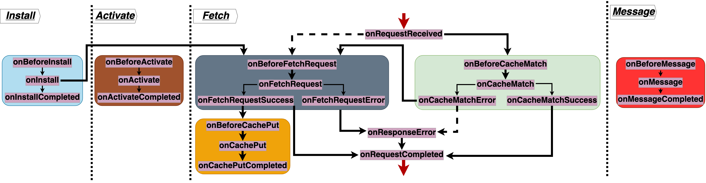

# swebRequest: the secure service workers library


## Examples
> A whole service worker in standalone mode, using 
```javascript
importScripts("swebRequest.js");
swebRequest.init();
```

> Standalone use of `swebRequest` with the [cspnonces](features/cspnonces/index.md), [anonymize_xor](features/anonymize_xor/index.md), [encryption](features/encryption/index.md) and [decryption](features/decryption/index.md) features
```javascript
importScripts("swebRequest.js");
swebRequest.init({
	anonymize_xor: null, cspnonces: null,
	encryption: { randomBytes: atob("yQL1TPO7aTs5zpEEw+00XN6+kNUMxUSAHoBLNBes5NY=") },
	decrytion: { randomBytes: atob("yQL1TPO7aTs5zpEEw+00XN6+kNUMxUSAHoBLNBes5NY=") }
});
```

> Standalong usage of `swebRequest` with the [cspnonces](features/cspnonces/index.md), [anonymize_xor](features/anonymize_xor/index.md), [encryption](features/encryption/index.md) and [decryption](features/decryption/index.md) features. 
```javascript
importScripts("swebRequest.js");
swebRequest.usefeatures({
	anonymize_xor: null, cspnonces: null,
	encryption: { randomBytes: atob("yQL1TPO7aTs5zpEEw+00XN6+kNUMxUSAHoBLNBes5NY=") },
	decryption: { randomBytes: atob("yQL1TPO7aTs5zpEEw+00XN6+kNUMxUSAHoBLNBes5NY=") }
});
```


Table of contents
- [API](api/index.md)
- [Demos](demos/index.md)
	- [Our main demo website](demos/wbox/index.md)
	- [Our Wordpress site](demos/wordpress/index.md)
	- [Any website](demos/bbox/index.md)
- [Installation](installation/index.md)
	- [Single line integration](installation/sli/index.md)
	- [Wordpress plugin](installation/wordpress/index.md)
- [Contexts](contexts/index.md)
	- [Websites](contexts/websites/index.md)
	- [Chrome extensions](contexts/extensions/index.md)
	- [Cloudflare Workers](contexts/cloudflare/index.md)
- [Modes](modes/index.md)
	- [standalone](modes/standalone/index.md)
	- [standalong](modes/standalong/index.md)
	- [workbox](modes/workbox/index.md)
- [Stages](stages/index.md)
	- [fetch](stages/fetch/index.md)
	- [install](stages/install/index.md)
	- [activate](stages/activate/index.md)
	- [message](stages/message/index.md)
- [Features](features/index.md)
	- [encryption](features/encryption/index.md)
	- [decryption](features/decryption/index.md)
	- [signature](features/signature/index.md)
	- [verification](features/verification/index.md)
	- [cspnonces](features/cspnonces/index.md)
	- [originpolicies](features/originpolicies/index.md)
	- [anonymize](features/anonymize/index.md)
	- [anonymize_xor](features/anonymize_xor/index.md)
	- [injectscripts](features/injectscripts/index.md)
	- [timestamp](features/timestamp/index.md)
	- [timestamp_verify](features/timestamp_verify/index.md)
	- [secureswsregistration](features/secureswsregistration/index.md)
	- [swcookie](features/swcookie/index.md)
	- [setRequestHeaders](features/setRequestHeaders/index.md)
	- [setResponseHeaders](features/setResponseHeaders/index.md)
	- [navigationPreload](features/navigationPreload/index.md)
	- [firewall](features/firewall/index.md)
	- [securerandomtoken](features/securerandomtoken/index.md)
	- [randomtoken](features/randomtoken/index.md)
	- [perfstart](features/perfstart/index.md)
	- [perfsend](features/perfstart/index.md)
- [Strategies](strategies/index.md)
	- [cacheFirst](strategies/cacheFirst/index.md)
	- [cacheOnly](strategies/cacheOnly/index.md)
	- [cacheAndRevalidate](strategies/cacheAndRevalidate/index.md)
	- [networkOnly](strategies/networkOnly/index.md)
	- [networkFirst](strategies/networkFirst/index.md)
	- [networkFirstTimeout](strategies/networkFirstTimeout/index.md)
	- [precaching](strategies/precaching/index.md)
	- [cleanup](strategies/cleanup/index.md)
	- [postMessage](strategies/postMessage/index.md)
- [Hooks](hooks/index.md)
	- [fetch](hooks/fetch/index.md)
	- [cache](hooks/cache/index.md)
	- [indexedDB](hooks/indexedDB/index.md)


