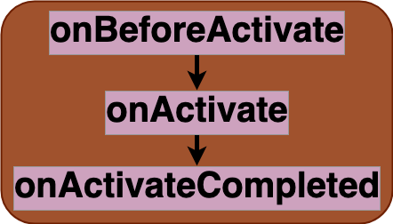

# Activate

Breakdown of the service workers [activate event](https://developer.mozilla.org/en-US/docs/Web/API/ServiceWorkerGlobalScope/activate_event). This event, fired once, during the activation phase, is commonly leveraged to cleanup assets left by old versions of the service worker. 

## Listener parameters
Properties of stages listeners `details` parameters are shown in [details](../details.md)
- [common properties](../details.md#all-events-properties)

## Stages
|||
|--|--|
[onBeforeActivate](../stages/onBeforeActivate.md) | entry stage of the activate event 
[onActivate](../stages/onActivate.md) | main stage of the activate event 
[onActivateCompleted](../stages/onActivateCompleted.md) | exit stage of the activate event 

## Strategies
|||
|--|--|
[cleanup](../strategies/cleanup.md) | cleanup  assets
