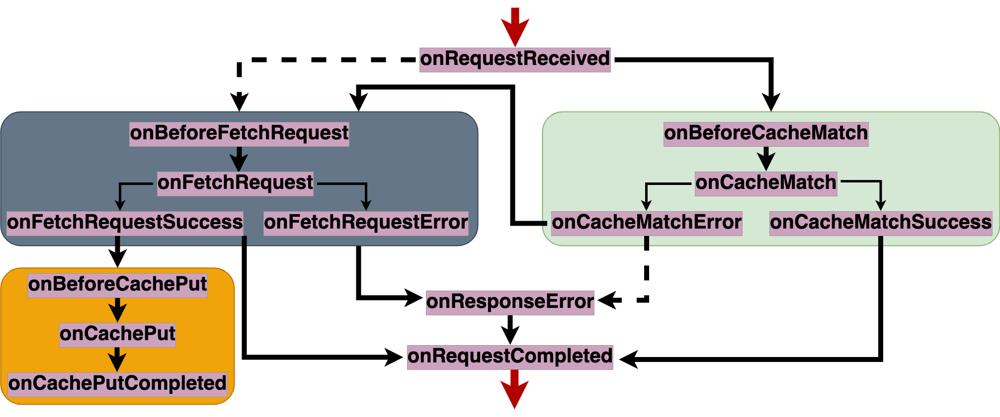

# Fetch event
The [fetch event](https://developer.mozilla.org/en-US/docs/Web/API/FetchEvent) of service workers can be registered to receive HTTP requests and provide a response to fullfil them. Only a single instance of this event is allowed per service worker, which makes it difficult to implement custom features on top of the raw fetch event. Here is an example of a service worker with the raw API.
```javascript
addEventListener('fetch', (event) => {
    event.respondWith( (async () => {
        let response = await caches.match(event.request.clone())
        if (response) return response
        response = await fetch(event.request.clone())
        let cache = await caches.open('v1')
        await cache.put(event.request.clone(), response.clone())
        return response
    }) () )
})
```

To alleviate the complexity of the raw [fetch event](https://developer.mozilla.org/en-US/docs/Web/API/ServiceWorkerGlobalScope/fetch_event), `swebRequest` breaks down the event into a set of stages.  

## Routing strategies
HTTP requests intercepted go through a [set of stages](#stages), with the goal to generate a response that will be used to fulfill the request and response to the client. This set of proposed stages and the [cacheFirst](../strategies/cacheFirst.md) is based on the observation that service workers tend to perform 3 main actions: [cache-reads](#cache-read), [network-fetch](#network-fetch)  and [cache-writes](#cache-write). 
The order in which those actions take place is refered to as a [routing strategy](https://web.dev/offline-cookbook/). 

The choice made in `swebRequest` is to follow a [cache-first or offline-first routing strategy](https://web.dev/offline-cookbook/#cache-falling-back-to-network): cache-reads are performed first, network-fetch is performed in case of cache-miss, and network responses are stored in the cache. This a natural choice because the added value of service workers is to make it possible to serve cached responses first, and only fallback to the network in case there is no cached response. `swebRequest` implement the necessary logic and 3 main stages, with default built-in listeners, where [cache-read](#cache-read), [network-fetch](#network-fetch) and [cache-write](#cache-write) are automatically performed.  

## Alleviated Complexity
As an example, the following code is a full-fledge service worker, serving content in the cache if available, and falling back to the network otherwise, and storing copies of network responses in the cache for future accesses. 
```javascript
importScripts('swebRequest.js')
swebRequest.init();
```

## Features on top of service workers
On top of the default [cacheFirst](../strategies/cacheFirst.md) routing strategy followed by `swebRequest`, [custom strategies](#strategies) can be easily defined, and applied to specific types of requests and responses. But more importantly, `swebRequest` makes it possible to augment service workers with security and privacy features. This is achieved by decorating the main stages with auxiliary stages that can manipulate requests and responses **before** and **after** or **depending** on the **success** of the main stage. The following example is the same service worker as above augmented with [encryption](../features/encryption.md) and [decryption](../features/encryption.md) features that protect cached responses, and the [anonymize_xor](../features/anonymize_xor.md) feature that removes credentials from third party requests. 

```javascript
importScripts('swebRequest.js')
swebRequest.init({
    encryption: { randomBytes: "r@nd0m321" },
    decryption: { randomBytes: "r@nd0m321" },
    anonymize_xor: null
});
```


## Stages


### Cache-read
cache-read are preformed at the [onCacheMatch](../stages/onCacheMatch.md) stage. Around it, the auxiliary stages provide opportunity to implement custom features on top of the cached responses. Both the cache and the indexedDB storage are supported. 
|||
|--|--|
[onCacheMatch](../stages/onCacheMatch.md) | main stage where cache-reads are performed
[onBeforeCacheMatch](../stages/onBeforeCacheMatch.md) | entry stage of before cache read
[onCacheMatchSuccess](../stages/onCacheMatchSuccess.md) | cache-hit stage
[onCacheMatchError](../stages/onCacheMatchError.md) | cache-miss stage

### Cache-write
cache-write are preformed at the [onCachePut](../stages/onCachePut.md) stage.
Around it, the auxiliary stages provide opportunity to implement custom features on top of the responses to be cached. Both the cache and the indexedDB storage are supported. 
|||
|--|--|
[onCachePut](../stages/onCachePut.md) | main stage where cache-writes are performed
[onBeforeonCachePut](../stages/onBeforeonCachePut.md) | entry stage of before cache writes
[ononCachePutCompleted](../stages/ononCachePutCompleted.md) | exit stage of cache writes

### Network-fetch
network-fetch are preformed at the [onFetchRequest](../stages/onFetchRequest.md) stage. 
Around it, the auxiliary stages provide opportunity to implement custom features on top of the responses downloaded from the network. Requests can be made with timeout and [navigation preload](../features/navigationPreload.md) is supported out-of-the-box
|||
|--|--|
[onFetchRequest](../stages/onFetchRequest.md) | main stage where network-fetch is performed
[onBeforeFetchRequest](../stages/onBeforeCacheMatch.md) | entry stage of before network-fetch
[onFetchRequestSuccess](../stages/onFetchRequestSuccess.md) | network-hit stage
[onFetchRequestError](../stages/onFetchRequestError.md) | network-error stage

### Other stages 
|||
|--|--|
[onRequestReceived](../stages/onRequestReceived.md) | entry stage of the fetch event
[onResponseError](../stages/onResponseError.md) | error stage: no cache or network response is available 
[onRequestCompleted](../stages/onRequestCompleted.md) | exit stage: a response is sent to the client


## Features
Features are implemeted at auxiliarly stages to take specific actions on HTTP requests and responses. 
| Feature | Description | Stages |
|--|--|--|
[encryption](../features/encryption.md) | encrypt responses before cache-write | [onBeforeCachePut](../stages/onBeforeCachePut.md)
[signature](../features/signature.md) | sign (HMAC) responses before cache-write | [onBeforeCachePut](../stages/onBeforeCachePut.md)
[timestamp](../features/timestamp.md) | timestamp responses before cache-write | [onBeforeCachePut](../stages/onBeforeCachePut.md)
|||
[decryption](../features/decryption.md) | decrypt responses after cache-read | [onCacheMatchSuccess](../stages/onCacheMatchSuccess.md)
[verification](../features/verification.md) | verify responses after cache-read | [onCacheMatchSuccess](../stages/onCacheMatchSuccess.md)
[cspnonces](../features/cspnonces.md) | refresh CSP nonces after cache-read cache-write | [onCacheMatchSuccess](../stages/onCacheMatchSuccess.md)
[timestamp_verify](../features/timestamp_verify.md) | verify timestamped responses after cache-read cache-write | [onCacheMatchSuccess](../stages/onCacheMatchSuccess.md)
|||
[setRequestHeaders](../features/setRequestHeaders.md) | add custom headers to requests before network-fetch | [onBeforeFetchRequest](../stages/onBeforeFetchRequest.md)
[swcookie](../features/swcookie.md) | add a specific header to requests before network-fetch | [onBeforeFetchRequest](../stages/onBeforeFetchRequest.md)
[anonymize_xor](../features/anonymize_xor.md) | anonymize, i.e. remove credentials from third party requests before network-fetch | [onBeforeFetchRequest](../stages/onBeforeFetchRequest.md)
[anonymize](../features/anonymize_xor.md) | anonymize, i.e. remove credentials from all requests before network-fetch | [onBeforeFetchRequest](../stages/onBeforeFetchRequest.md)
|||
[originpolicies](../features/originpolicies.md) | add custom security headers to responses before responding to client | [onRequestCompleted](../stages/onRequestCompleted.md)
[injectscripts](../features/injectscripts.md) | add JavaScript codes to HTML responses before responding to client | [onRequestCompleted](../stages/onRequestCompleted.md)
|||
[firewall](../features/firewall.md) | cancel requests right when they are received | [onRequestReceived](../stages/onRequestReceived.md)
|||
[randomvalues](../features/randomvalues.md) | generate random bytes. This feature works best on [Cloudflare workers](../contexts/cloudflare.md) | [onRequestReceived](../stages/onRequestReceived.md)
[proxyrewriterequests](../features/proxyrewriterequests) | rewrite proxied requests right when they are received. This feature works best on [Cloudflare workers](../contexts/cloudflare.md) | [onRequestReceived](../stages/onRequestReceived.md)
[proxyrewriteresponses](../features/proxyrewriteresponses) | rewrite proxied responses right when they are received. This feature works best on [Cloudflare workers](../contexts/cloudflare.md) | [onFetchRequestSuccess](../stages/onFetchRequestSuccess.md)


## Strategies
|||
|--|--|
[cacheFirst](../strategies/cacheFirst.md) | cached responses first, and use network as a fallback
[cacheOnly](../strategies/cacheOnly.md) | only cached responses routing
[cacheAndRevalidate](../strategies/cacheAndRevalidate.md) | cached responses first, but also update them with fresh network responses
[cacheOrNetwork](../strategies/cacheOrNetwork.md) | the fastest network or cached response is considered
[networkFirst](../strategies/networkFirst.md) | network response first and use cache as a fallback
[networkOnly](../strategies/networkOnly.md) | network responses only
[networkFirstTimeout](../strategies/networkFirstTimeout.md) | network first (with a timeout) and use cache as fallback

## Usage modes
||||
|--|--|--|
[standalone](../modes/standalone.md) | [standalong](../modes/standalong.md) | [workbox](../modes/workbox.md)

## Usage contexts
||||
|--|--|--|
[websites](../contexts/websites.md) | [cloudflare](../contexts/cloudflare.md) | [extensions](../contexts/extensions.md) | [wordpress](../contexts/wordpress.md)


## Related events
- [install](install.md)
- [activate](activate.md)
- [message](message.md)