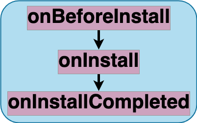

# Install

Breakdown of the service workers [install event](https://developer.mozilla.org/en-US/docs/Web/API/ServiceWorkerGlobalScope/install_event). This event, fired once, during the installation or update of service workers, is commonly leveraged to precache assets, i.e. HTTP responses of different resources URLs, that will be available when the service worker handles functional events, i.e. the fetch event fired for HTTP requests issued by service worker clients, i.e. pages

## Stages
|||
|--|--|
[onBeforeInstall](../stages/onBeforeInstall.md) | entry stage of the install event 
[onInstall](../stages/onInstall.md) | main stage of the install event 
[onInstallCompleted](../stages/onInstallCompleted.md) | exit stage of the install event 

## Strategies
|||
|--|--|
[precaching](../strategies/precaching.md) | precache assets

## Features
|||
|--|--|
[precaching](../features/precaching.md) | precache assets

