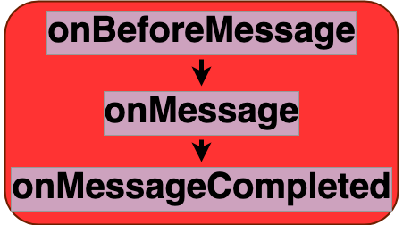

# Message event

The [message event](https://developer.mozilla.org/en-US/docs/Web/API/ServiceWorkerGlobalScope/message_event) support in `swebRequest` has been added first of all for compatibility reasons. To illustrate the potential issue, let's consider a web page what is trying to read a cached response. If it does so directly from the page context, it may end with a response encrypted by `swebRequest`. To avoid this issue, the page could rather send a message to the service worker that will read the response, decrypt and potentially send it back to the client. The service worker still retains full control on whether those interactions are allowed or not. 

## The swrclient
[swrclient.js](../lib/swrclient.js) is a companion `swebRequest` than can be use to exchange messages with `swebRequest` in a service worker, using post messages. Messages and specially formatted. In particular, response and requests objects are serialized and special fields are added with unique tokens that are reflected in the responses sent by the service worker and used to map the original message sent to it, and help deliver the response to the client.

## Listener parameters
Properties of stages listeners `details` parameters are shown in [details](../details.md)
- [common properties](../details.md#all-events-properties)
- [specific message event stages listeners parameters properties](../details.md#message-event-specific-properties)
- [specific message event stages listeners return properties](../details.md#return-message-event-specific-properties)

## Stages
|||
|--|--|
[onBeforeMessage](../stages/onBeforeMessage.md) | entry stage of the message event 
[onMessage](../stages/onMessage.md) | main stage of the message event 
[onMessageCompleted](../stages/onMessageCompleted.md) | exit stage of the message event 

## Strategies
|||
|--|--|
[postMessage](../strategies/postMessage.md) | handle post messages
