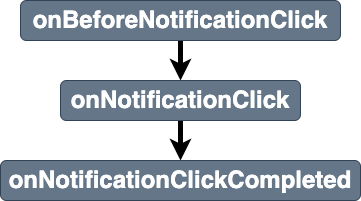

# notificationclick

Breakdown of the service workers [notificationclick event](https://developer.mozilla.org/en-US/docs/Web/API/ServiceWorkerGlobalScope/notificationclick_event). 

## Listeners parameters
Properties of stages listeners `details` parameters are shown in [details](../details.md)
- [common properties](../details.md#all-events-properties)
- [specific notificationclick event stages listeners parameters properties](../details.md#notificationclick-events-specific-properties)

## Stages
|||
|--|--|
[onBeforeNotificationClick](../stages/onBeforeNotificationClick.md) | entry stage of the `notificationclick` event 
[onNotificationClick](../stages/onNotificationClick.md) | main stage of the `notificationclick` event 
[onBeforeNotificationClickCompleted](../stages/onBeforeNotificationClickCompleted.md) | exit stage of the `notificationclick` event 