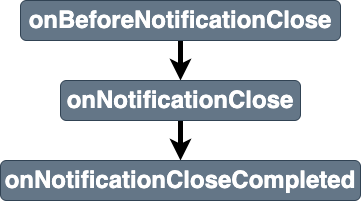

# notificationclose

Breakdown of the service workers [notificationclose event](https://developer.mozilla.org/en-US/docs/Web/API/ServiceWorkerGlobalScope/notificationclose_event). 

## Listeners parameters
Properties of stages listeners `details` parameters are shown in [details](../details.md)
- [common properties](../details.md#all-events-properties)

## Stages
|||
|--|--|
[onBeforeNotificationClose](../stages/onBeforeNotificationClose.md) | entry stage of the `notificationclose` event 
[onNotificationClose](../stages/onNotificationClose.md) | main stage of the `notificationclose` event 
[onBeforeNotificationCloseCompleted](../stages/onBeforeNotificationCloseCompleted.md) | exit stage of the `notificationclose` event 