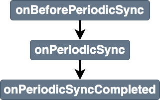

# periodicsync

Breakdown of the service workers [activate ](https://developer.mozilla.org/en-US/docs/Web/API/PeriodicSyncEvent). 

## Listener parameters
Properties of stages listeners `details` parameters are shown in [details](../details.md)
- [common properties](../details.md#all-events-properties)
- [specific periodic event stages listeners parameters properties](../details.md#periodicsync-events-specific-properties)

## Stages
|||
|--|--|
[onBeforePeriodicSync](../stages/onBeforePeriodicSync.md) | entry stage of the periodicsync event 
[onPeriodicSync](../stages/onPeriodicSync.md) | main stage of the periodicsync event 
[onPeriodicSyncCompleted](../stages/onPeriodicSyncCompleted.md) | exit stage of the periodicsync event 