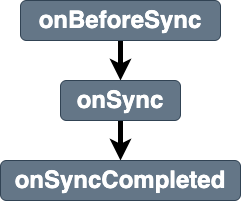

# sync

Breakdown of the service workers [sync event](https://developer.mozilla.org/en-US/docs/Web/API/SyncEvent). This event can be used to submit pending tasks that have be saved offline. 

## Listener parameters
Properties of stages listeners `details` parameters are shown in [details](../details.md)
- [common properties](../details.md#all-events-properties)
- [specific sync event stages properties](../details.md#sync-events-specific-properties)

## Stages
|||
|--|--|
[onBeforeSync](../stages/onBeforeSync.md) | entry stage of the Sync event 
[onSync](../stages/onSync.md) | main stage of the Sync event 
[onSyncCompleted](../stages/onSyncCompleted.md) | exit stage of the Sync event 