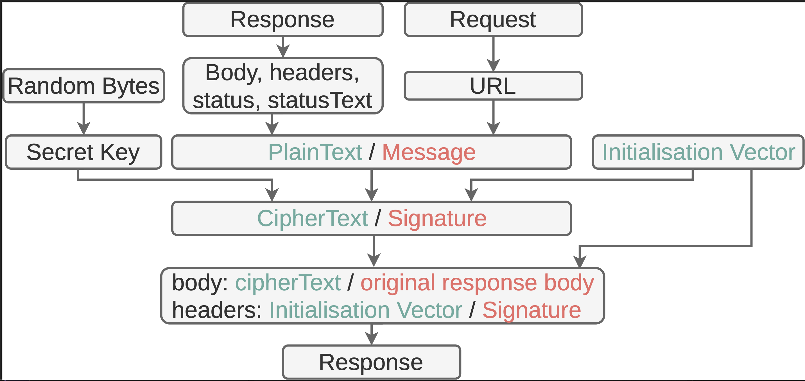

# Signature 
The `signature` feature signs HTTP responses before cache writes. More precisely, it computes the hash-based message authentication code (HMAC) of responses before cache writes.
It should be combined with the [verification](verification.md) feature. 


### runtime options
||| 
|--|--| 
| `randomBytes` |  a string of random bytes to used to derive the cryptographic key that will be used to perform `signature`. It is accessed in the feature listener under `details.filter.randomBytes`
See how to use 


### examples 

Working examples of the `signature` feature. These are the ones deployed on the [demo website](https://swebrequest.doitsec.net/sqwrfeatures.htm). 
||||
|--|--|--|
[standalone](../examples/signature.js) | [standalong](../examples/usignature.js) | [workbox](../examples/wsignature.js)
|||

Following are more example usages
- enable directly [standalone or standalong]
```javascript
swebRequest.features.signature({ randomBytes: "r@nd0m3" }) 
```

- standalone
```javascript
swebRequest.init({ signature: { randomBytes: "r@nd0m3" } })
```

- standalong
```javascript
swebRequest.usefeatures({ signature: { randomBytes: "r@nd0m3" } })
```

- workbox
```javascript
new workbox.strategies.CacheFirst({ plugins: [ 
    new swebRequest.commons.plugin("signature", { randomBytes: "r@nd0m3" })
]})
```

## Scheme



## Definition
```javascript
swebRequest.features.define('signature', async (details: Details): Promise<Details> => {
    try {
        let message = await Utils.serializeResponseForEncryption(details.request.url, details.responseBody, details.responseHeaders, details.response.status, details.response.statusText)
        if (!thiself.signatureKey)
            thiself.signatureKey = await Utils.importSecretKeySignatures(Uint8Array.from(details.filter.randomBytes.split('')))
        let signature = await Utils.signing(thiself.signatureKey, message);
        details.responseHeaders['last-modified'] = btoa(await Utils.arrayBufferToString (signature))
        return { responseHeaders: details.responseHeaders }
    } catch(e) {}
    return {};
}, ['onBeforeCachePut'], { rtypes: ['default', 'basic', 'cors'] }, ['responseHeaders', 'responseBody=arrayBuffer']);
```

### listener
The message to sign is an object made of the request url (`details.request.url`), the original response body (`details.response.body`), the serialized response headers (`details.responseHeaders`), the response status (`details.response.status`) and statusText (`details.response.statusText`). The message is serialized into an arrayBuffer, the format suitable for signature. The random bytes, held in the `randomBytes` runtime option are used to derive the signature key. Then, signature is computed with the key and the message and stored in the CORS-safelisted `last-modified` response header. The original response will be combined with the new response headers to generate a new response object that will be stored in the cache.

### stages 
||| 
|--|--| 
`onBeforeCachePut` | [the stage](../stages/onBeforeCachePut.md) the stage right before [cache write](../stages/onCachePut.md)


### filter options
||| 
|--|--| 
`rtypes` | `['default', 'basic', 'cors']`: signature can be applied on all responses whose bodies can be read, this includes same-origin and successful CORS responses

### extra options
||| 
|--|--|
`responseHeaders` | the response headers will be serialized and included in the `details` object passed to the listener
`responseBody=arrayBuffer` | the response body serialized as an arrayBuffer 

### return object
||| 
|--|--|
`responseHeaders` | the CORS-safelisted `last-modified` header hold the IV

The new response headers (original headers + the signature) will be combined with the original response (body, status, statuText) to generate a new response that will be stored in the cache.  


## See also
- [randombytes](../utils/randombytes.md)
- [randomvalues](randomvalues.md)
- [encryption](encryption.md)
- [decryption](decryption.md)
- [verification](verification.md)
- [Cloudflare Workers](../contexts/cloudflare.md)
- [fetch event](../events/fetch.md)
