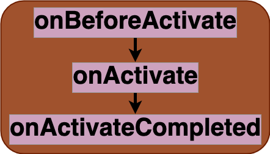

Breakdown of the service workers [activate](https://developer.mozilla.org/en-US/docs/Web/API/ServiceWorkerGlobalScope/activate_event) event. This event, fired once, during the installation or update of service workers, is commonly leveraged to cleanup assets left by old versions of the service worker. 

## Entry stage
- `onBeforeActivate`:

## Main stage
- `onActivate`:

## Exit stage
- `onActivateCompleted`:

## Related Features
- `clients.claim`:
- `cleanup`:

## Related Strategies
- `cleanup`