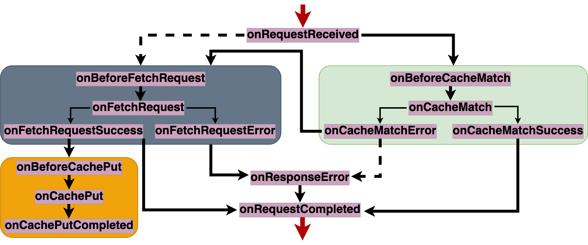

# Fetch Stages


Breakdown of the service workers [fetch](https://developer.mozilla.org/en-US/docs/Web/API/ServiceWorkerGlobalScope/fetch_event) event. HTTP requests intercepted go through a set of stages, with the goal to build a response to reply to the client. Stages are fired in a certain order. This order is known as the [cache-first](https://developer.chrome.com/docs/workbox/caching-strategies-overview/#cache-first-falling-back-to-network)


## Entry stage
- `onRequestReceived`:


## cache-read stages

- `onBeforeCacheMatch`:
- `onCacheMatch`:
    - `onCacheMatchSuccess`:
    - `onCacheMatchError`: 

## network-fetch stages
- `onBeforeFetchRequest`:
- `onFetchRequest`:
    - `onFetchRequestSuccess`:
    - `onFetchRequestError`:

## cache-write stages
- `onBeforeCachePut`:
- `onCachePut`:
- `onCachePutCompleted`:

## Error stage
- `onResponseError`

## Exit stage
- `onRequestCompleted`


## Related Features


## Related Strategies


## Implementation details

### Standalone mode
In this mode, `swebRequest` is used to handle HTTP requests as they are intercepted by the `fetch` event and provide an HTTP response to them. 

```javascript
addEventListener('fetch', (event) => {    
    event.respondWith(swebRequest["onRequestReceived"].execute({
        request: event.request, response: undefined, phase: 'fetch', event: event 
    }))
});
```

### Standalong mode
In this mode, `swebRequest` is being used along an existing service worker. we hook into a couple of service workers APIs in order to 
```javascript

```