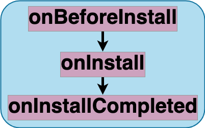

# Install stages

Breakdown of the service workers [install](https://developer.mozilla.org/en-US/docs/Web/API/ServiceWorkerGlobalScope/install_event) event. This event, fired once, during the installation or update of service workers, is commonly leveraged to precache assets, i.e. HTTP responses of different resources URLs, that will be available when the service worker handles functional events, i.e. the fetch event fired for HTTP requests issued by service worker clients, i.e. pages

## Entry stage
- `onBeforeInstall`:

## Main stage
- `onInstall`:

## Exit stage
- `onInstallCompleted`:

## Related Features
- `skipWaiting`:
- `precaching`:

## Related Strategies
- `precaching`