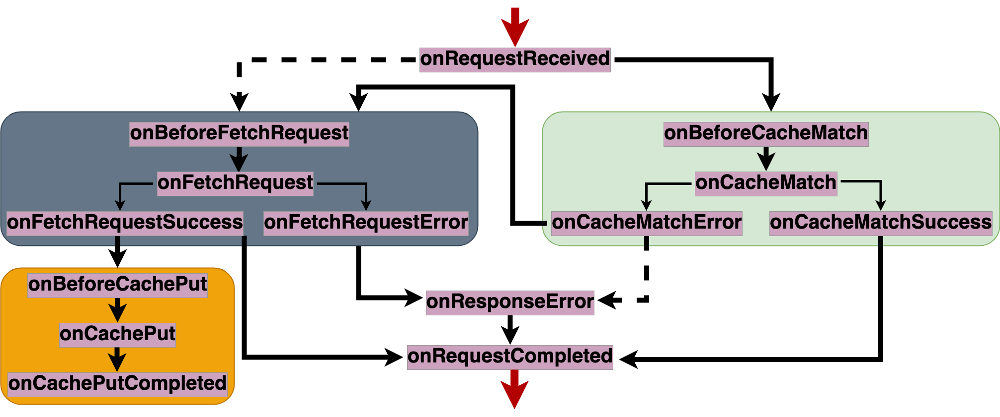

# Strategies
A strategy is a named set of stages. Their main purpose is to make it easy to apply the same options [filter](#filter.md) and [extra](extra_options.md) to all the stages in the strategy. 
Nonetheless, the can also implement routing and caching purposes. 

Strategies names are case sensitive, expect for the first character. For instance, `cacheFirst` and `CacheFirst` refer to the same strategy

## definition
### Syntax
Strategies are defined as follows
```javascript
swebRequest.strategies.define(name: string, stages: string[] | { [key: string]: CallBack } ) => void
```

### Parameters
- `name`: the name of the strategy, i.e. `cacheFirst`, `networkOnly`
- `stages`: the set of stages that make up the strategy, each associated to a `listener`. For stages that have default built-in listeners (i.e. `onCacheMatch`, `onFetchRequest`, `onCachePut`, `onInstall`, `onActivate`), the listener can be `null` when defining the strategy, in which case the default listener will be applied to the stage when the feature is invoked. 


## Usage
```javascript
swebRequest.strategies.STRATEGY(filter?: FilterOptions, extra_options?: ExtraOptions, xfilter?: FilterOptions)
```

## Strategies built-in
- Fetch event
    - [cacheFirst](#cachefirst)
    - [cacheOnly](#cacheonly)
    - [cacheAndRevalidate](#cacheandrevalidate)
    - [networkFirst](#networkfirst)
    - [networkOnly](#networkonly)
    - [networkFirstTimeout](#networkfirstimeout)
    - [concurrentNetworkOrCache](#concurrentnetworkorcache)
- Activate event
    - [cleanup](#cleanup)
- Install event
    - [precaching](#precaching)
    
## Fetch event


### cacheFirst
The `cacheFirst` or `CacheFirst` strategy is the default routing strategy followed in `swebRequest`, as shown in the Figure above. 
The whole code that defines it is as shown. 
```javascript
swebRequest.strategies.define('cacheFirst', ['onCacheMatch', 'onFetchRequest', 'onCachePut'])
```
After the fetch event is fired with a request, the `onRequestReceived` stage is first entered. At this point, the request filtered. Then, the  [cache read](stages.md#cache-read) stages are handled first. If there is a response in the cache (cache-hit), it is served to the client, by entering the `onRequestCompleted` stage. Otherwise - in case of a cache-miss - the [network-fetch](stages.md#network-fetch) stages are handled to download a fresh response from the origin server. In case of a network-hit, a copy of the response is sent to the [cache-write](stages.md#cache-write) stages where it will be stored in the cache. Then, another copy is served to the client, by entering the the cache `onRequestCompleted` stage. 
Other routing strategies are built on the default `cacheFirst` strategy. 

### cacheOnly
The `cacheOnly` or `CacheOnly` strategy is defined as follows.
```javascript
swebRequest.strategies.define('cacheOnly', {
    onCacheMatchError: () => { return { next: 'onResponseError' } }
});
```
It reads as ***even when there is a cache-miss, do not perform network-fetch***. As shown in the Figure above, when there is a cache-miss, the `onCacheMatchError` stage is entered, and after that stage, the network-stages are handled. As the `cacheOnly` does not perform network fetch, the `onCacheMatchError` stage rather branches tot he `onResponseError` stage. This is a stage where one can provide a custom or fallback response to be served to the client at the subsequent `onRequestCompleted` stage.
This strategy works best when responses have been precached. One should also consider generating custom or fallback responses in case of cache-misses. 

### cacheAndRevalidate
The `cacheAndRevalidate` or `CacheAndRevalidate` or `staleWhileRevalidate` or `StaleWhileRevalidate` strategy can be understood as a `cacheFirst` strategy that additional performed network fetch and cache writes: cached responses are served but also updated with a fresh network one. This strategy is defined as follows:
```javascript
swebRequest.strategies.define('cacheAndRevalidate', {
    onCacheMatchSuccess: () => { return { parallels : ['onBeforeFetchRequest'] } }
});
```
While following the default `cacheFirst` strategy, if there is a cache-hit, still perform network-fetch, and subsequently cache-writes stages. 

### concurrentNetworkOrCache
The `concurrentNetworkOrCache` (or `ConcurrentNetworkOrCache`), `concurrentCacheOrNetwork` (or `ConcurrentCacheOrNetwork`), `cacheOrNetwork` (or `CacheOrNetwork`), `networkOrCache` (or `NetworkOrCache`) performs network fetch and cache-read concurrently. The first to complete wins. 
The strategy is defined as follows:
```javascript
swebRequest.strategies.define('networkOrCache', {
    onRequestReceived: () => { return { next: 'onBeforeFetchRequest', parallels: ['onBeforeCacheMatch'] } },
    onCacheMatchError: async (details: Details) => {
        if (details.filter && details.filter.timeout)
            await waitingTime(details.filter.timeout) 
        return { next : 'onResponseError' }
    }
});
When a request is intercepted at the `onRequestReceived` stage, the network-fetch stages are entered next (via the `onBeforeFetchRequest` stage) and the cache-read stages are entered concurrently (via the `onBeforeCacheMatch` stage). The first concurrent branch to reach `onRequestCompleted` will have its response served to the client. Note the use of an optional timeeout when there is is a cache-miss. In fact, cache-misses are very cheap, and likely to complete before network-fetch. In that case, one can provide a time to be waited for. During this time, network-fetch may have been completed with a fresh response to be served to the client. As the cache is also updated with the network response, the next cache-read will likely lead to a cache-hit, and if it is quicker than the network-fetch, then it is used. 
Note that in any case, the cache is always  updated with a fresh network response.

### networkOnly
The `networkOnly` or `NetworkOnly` strategy does not use the cache. It is simply defined as follows:
```javascript
swebRequest.strategies.define('networkOnly', {
    onRequestReceived: () => { return { next: 'onBeforeFetchRequest' } },
    onBeforeCachePut: () => { return { next: 'onCachePutCompleted' } }
});
```
It reads: When a request is intercepted (at the `onRequestRecieved` stage), perform  network-fetch  (by entering the `onBeforeFetchRequest` stage). When the `onBeforeCachePut` stage is about to entered with a copy of the response to be stored in the cache, do not effectively perform cache-write at the next `onCachePut` stage, but rather jump to the `onCachePutCompleted` stage. 

### networkFirst
The `networkFirst` or `NetworkFirst` strategy tries first to download a fresh response from the origin server, then falls back to the cache in case of a network-miss. It is defined as follows:
```javascript
swebRequest.strategies.define('networkFirst', {
    onRequestReceived: () => { return { next: 'onBeforeFetchRequest' } },
    onFetchRequestError: () => { return { next: 'onBeforeCacheMatch' } },
    onCacheMatchError: () => { return { next : 'onResponseError' } }
});
```
When a request is intercepted, the `onBeforeFetchRequest` is entered to perform network-fetch. In case of network-hit, a copy of the response is subsequently stored in the cache, and another copy returned to the client. Otherwise, there is a network-miss, and cache-read will be attempted, by entering the `onBeforeCacheMatch` stage. To guard against infine loops in case of a cache-miss (and a network-miss), cache-misses do not trigger network-fetch. Instead, the `onResponseError` stage is entered where a custom response can be generated to fulfill the request. 

### networkFirstTimeout
The `networkFirstTimeout` or `NetworkFirstTimeout` strategy is exactly like the `networkFirst` strategy, expect that the network fetch is performed with a timeout.

```javascript
swebRequest.strategies.define('networkFirstTimeout', {
    onRequestReceived: () => { return { next: 'onBeforeFetchRequest' } },
    onFetchRequestError: () => { return { next: 'onBeforeCacheMatch' } },
    onCacheMatchError: () => { return { next : 'onResponseError' } },
    onFetchRequest: null
});
```
The sole different is the presence of the `onFetchRequest` stage. As this stage will be invoked with a timeout filter option, the `onFetchRequest` stage will be handled with this timeout.


